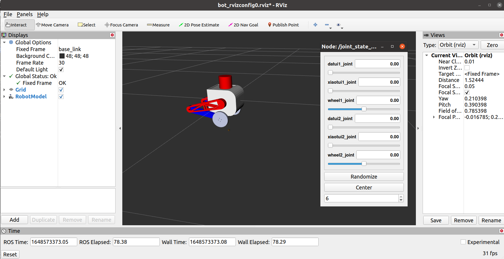
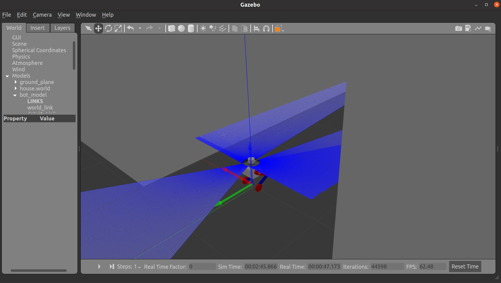
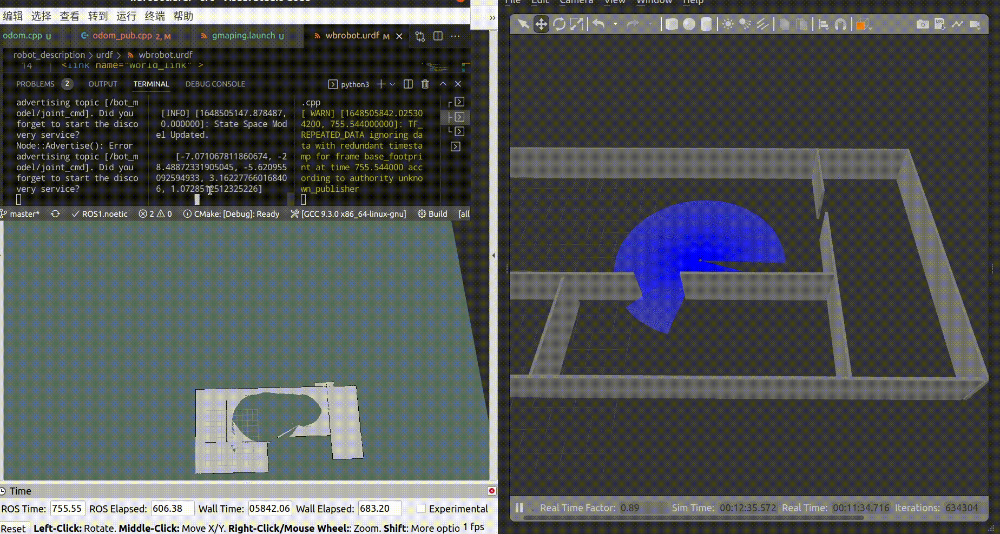

# wbrobot

## 使用

clone

`mkdir wbrobot_ws/src`

`cd ./wbrobot_ws/src` 

`catkin_init_workspace`

`git clone https://github.com/225ceV/wbrobot.git`

`cd ..`

`catkin_make`

`source ./devel/setup.bash`

1. 查看urdf模型和关节连接情况

	`roslaunch robot_description rviz_bot.launch`
	

2. gazebo运动仿真
	打开gazebo环境并导入机器人模型
	`roslaunch robot_description gazebo_sim.launch`
	打开后初始关节角度还不能满足要求，且模型倒地，先开控制器将模型初始化关节角度
	`roslaunch robot_control sim_with_py_controller.launch`
	在gazebo gui中暂停扶正后如图
	
	键盘控制
	关闭sim_with_py_controller.launch的命令行窗口
	`roslaunch robot_control odom.launch`
	在gazebo gui中重新开始仿真，在命令行中使用QWEASDZXC控制机器人运动方向
	
	
3. 基于多种算法的激光雷达二维建图
	gmapping
	在上述节点开启的情况下
	`roslaunch robot_control gmapping.launch`
	
	karto
	`roslaunch robot_control karto.launch`
	hector
	`roslaunch robot_control hector.launch`
	
